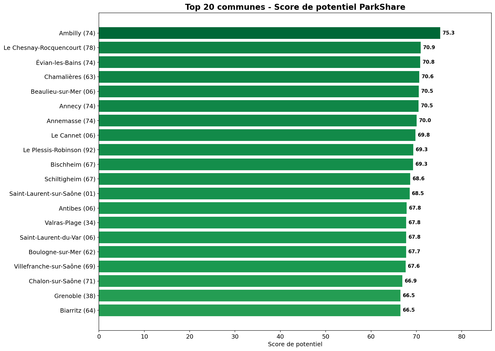
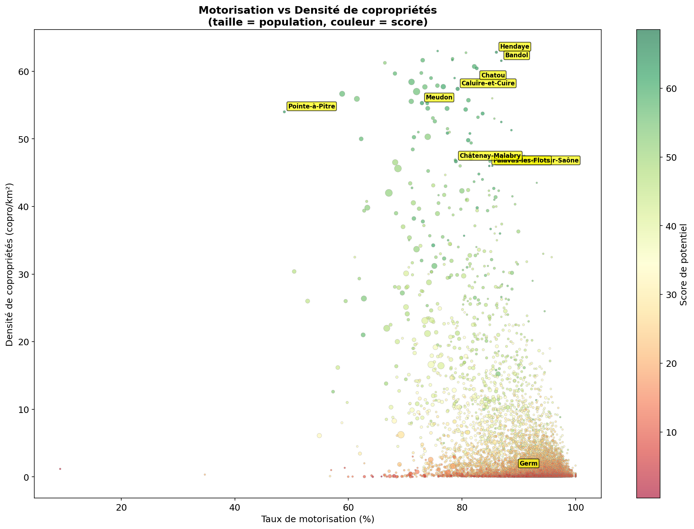
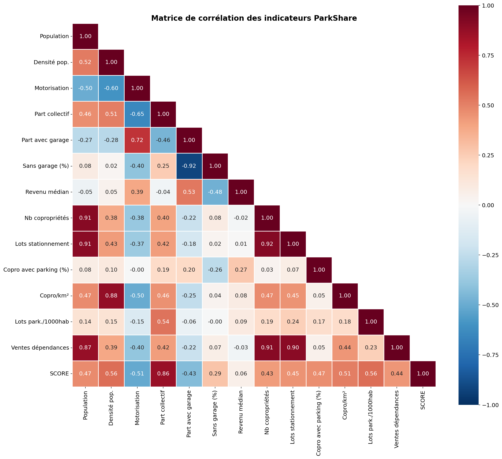
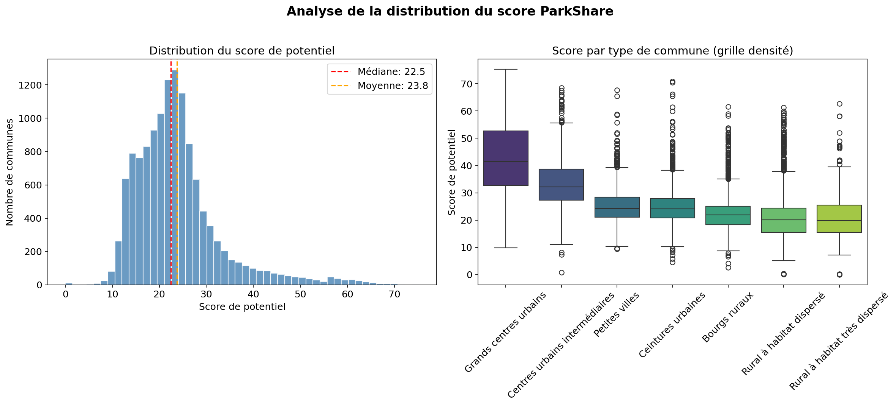
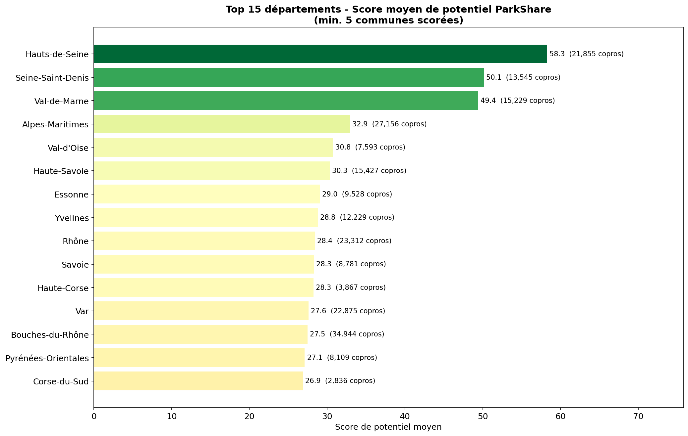

# ParkShare - Partie Data

## Objectif

Collecter, nettoyer et analyser des données ouvertes pour identifier les **zones géographiques à fort potentiel commercial** pour ParkShare (plateforme de partage de places de stationnement en copropriété).

## Sources de données

Toutes les données sont des **données ouvertes** (Open Data), téléchargeables sans authentification.

| # | Dataset | Source | URL | Période | Taille |
|---|---------|--------|-----|---------|--------|
| 1 | Taux de motorisation par commune | INSEE / data.gouv.fr | [Lien](https://www.data.gouv.fr/datasets/part-des-menages-disposant-au-moins-dune-voiture-taux-de-motorisation) | 2022 | 9 MB |
| 2 | Communes de France (population, densité) | data.gouv.fr | [Lien](https://www.data.gouv.fr/datasets/communes-et-villes-de-france-en-csv-excel-json-parquet-et-feather) | 2025 | 17 MB |
| 3 | Logements par commune (INSEE RP) | INSEE | [Lien](https://www.insee.fr/fr/statistiques/8581474) | 2022 | 99 MB |
| 4 | Revenus fiscaux par commune (Filosofi) | data.gouv.fr | [Lien](https://www.data.gouv.fr/datasets/revenu-des-francais-a-la-commune) | 2021 | 4.8 MB |
| 5 | Registre National des Copropriétés (RNIC) | ANAH / data.gouv.fr | [Lien](https://www.data.gouv.fr/datasets/registre-national-dimmatriculation-des-coproprietes) | T4 2025 | 438 MB |
| 6 | Demandes de Valeurs Foncières (DVF) | DGFiP / data.gouv.fr | [Lien](https://www.data.gouv.fr/datasets/demandes-de-valeurs-foncieres) | 2025 S1 | 177 MB |
| 7 | Contours géographiques communes | IGN / Etalab | [Lien](https://etalab-datasets.geo.data.gouv.fr/contours-administratifs/latest/geojson/) | 2025 | 32 MB |
| 8 | Base Nationale Lieux de Stationnement | transport.data.gouv.fr | [Lien](https://www.data.gouv.fr/datasets/base-nationale-des-lieux-de-stationnement) | 2024 | 206 KB |

Toutes les données sont les **dernières versions disponibles** au 30 mars 2026.

## Reproduire le pipeline

### Prérequis

```bash
pip install -r requirements.txt
```

### Exécution

```bash
cd data/

# 1. Nettoyage des données brutes -> data/cleaned/
python clean_datasets.py

# 2. Jointure + scoring + KPIs -> data/output/
python build_kpis.py

# 3. Visualisations -> data/output/*.png + carte_score.html
python build_visualizations.py

# 4. GeoJSON enrichi pour le dashboard -> data/output/communes_scored.geojson
python build_geojson.py
```

Ou lancer le notebook `notebook.ipynb` qui exécute tout le pipeline séquentiellement.

## Structure des fichiers

```
data/
├── raw/                        # Données brutes (téléchargées)
│   ├── motorisation_commune.csv
│   ├── communes_france.csv
│   ├── logements_insee/
│   ├── revenus_commune.csv
│   ├── rnic_t4_2025.csv
│   ├── ValeursFoncieres-2025-S1.txt
│   ├── communes_contours_100m.geojson
│   └── stationnement_bnls.csv
├── cleaned/                    # Données nettoyées (1 CSV par source)
│   ├── communes.csv            # 34 926 communes, 16 colonnes
│   ├── motorisation.csv        # 34 848 communes, 5 colonnes
│   ├── logements.csv           # 34 903 communes, 17 colonnes
│   ├── revenus.csv             # 31 322 communes, 12 colonnes
│   ├── rnic.csv                # 13 029 communes, 18 colonnes
│   ├── dvf.csv                 # 30 185 communes, 8 colonnes
│   └── stationnement.csv       # 161 communes, 7 colonnes
├── output/                     # Résultats finaux
│   ├── kpis_par_commune.csv    # Table finale (13 024 communes, 93 colonnes)
│   ├── top30_zones.csv         # Top 30 zones prioritaires
│   ├── communes_enrichies.csv  # Toutes les communes (34 926)
│   ├── communes_scored.geojson # GeoJSON enrichi pour le dashboard
│   ├── carte_score.html        # Carte interactive Plotly
│   ├── top20_score.png
│   ├── scatter_motorisation_copro.png
│   ├── heatmap_correlation.png
│   ├── distribution_score.png
│   └── top15_departements.png
├── clean_datasets.py           # Script de nettoyage
├── build_kpis.py               # Script de jointure + scoring
├── build_visualizations.py     # Script de visualisations
├── build_geojson.py            # Script GeoJSON enrichi
├── notebook.ipynb              # Notebook reproductible
├── requirements.txt            # Dépendances Python
├── PIPELINE.md                 # Description détaillée du pipeline
└── README.md                   # Ce fichier
```

## KPIs produits

### KPI 1 : Score de potentiel (0-100)

Score composite par commune, calculé comme la moyenne pondérée de 7 facteurs normalisés (min-max) :

| Facteur | Poids | Source | Justification |
|---------|-------|--------|---------------|
| Densité de copropriétés (copro/km²) | 20% | RNIC | Concentration des cibles commerciales |
| Taux de ménages sans garage | 20% | INSEE Logements | Demande latente de stationnement |
| Part logements collectifs | 15% | INSEE Logements | Parc adapté au modèle ParkShare |
| Lots parking / 1000 hab | 15% | RNIC | Offre partageable existante |
| Taux de motorisation | 10% | INSEE | Besoin de stationnement |
| Densité de population | 10% | INSEE | Tension urbaine |
| Part copro avec parking | 10% | RNIC | Infrastructure parking en copropriété |

La normalisation utilise les percentiles 1% et 99% pour être robuste aux outliers.

### KPI 2 : Classement Top N zones

Communes classées par score de potentiel décroissant. Top 5 :

| Rang | Commune | Département | Score |
|------|---------|-------------|-------|
| 1 | Ambilly | Haute-Savoie | 75.3 |
| 2 | Le Chesnay-Rocquencourt | Yvelines | 70.9 |
| 3 | Évian-les-Bains | Haute-Savoie | 70.8 |
| 4 | Chamalières | Puy-de-Dôme | 70.6 |
| 5 | Beaulieu-sur-Mer | Alpes-Maritimes | 70.5 |

### KPI 3 : Indice de tension stationnement

Formule : `(taux_motorisation / 100) x (taux_voiture_sans_garage / 100) x densite_population`

Mesure la pression sur le stationnement : plus l'indice est élevé, plus la demande de places dépasse l'offre. Top zones : Lannoy, Saint-Mandé, Roubaix, Tourcoing, Vincennes.

### KPI 4 : Densité d'opportunité copropriété

Formule : `nb_copropriétés / superficie_km2`

Mesure la concentration géographique des cibles. Top zones : Vincennes (654 copro/km2), Levallois-Perret (606), Saint-Mandé (601), Paris (434).

## Graphiques

### Top 20 communes par score


### Motorisation vs Densité de copropriétés


### Matrice de corrélation


### Distribution du score par type de commune


### Top 15 départements


## Données livrées pour la partie Dev

Le fichier **`output/communes_scored.geojson`** (19.5 MB) contient les contours géographiques de 13 009 communes enrichis avec :
- Score de potentiel et rang
- Tous les indicateurs (population, densité, motorisation, copropriétés, lots parking, revenus...)
- Prêt à être affiché sur une carte Leaflet/Mapbox/Folium

Le fichier **`output/kpis_par_commune.csv`** contient la table complète (93 colonnes) pour alimenter la base de données.
